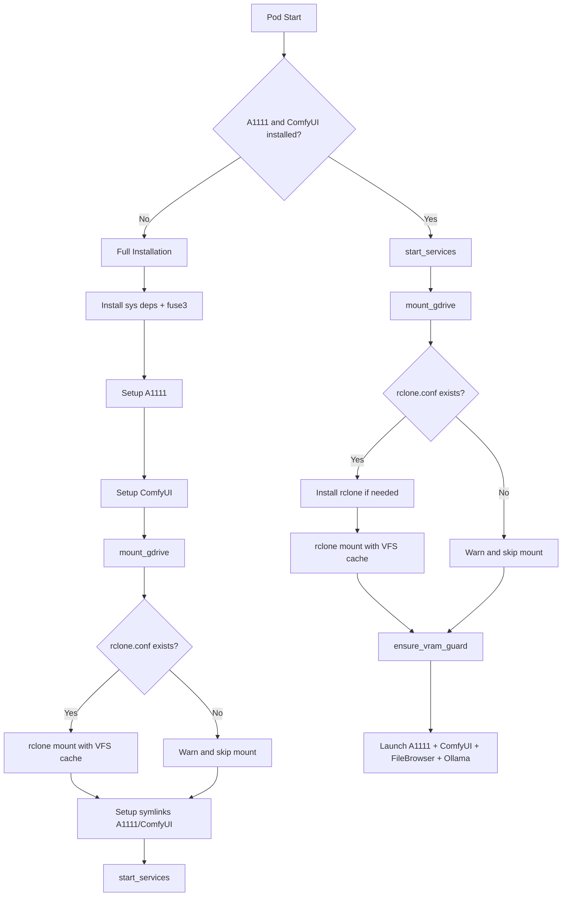

# Google Drive Model Sync via rclone VFS Cache

## Approach

Use **rclone mount** with `--vfs-cache-mode full` to mount a Google Drive folder as `/workspace/models`. This makes all files visible in the filesystem (directory listings are instant), but file contents are only downloaded when actually read (e.g., when A1111 or ComfyUI loads a model). Downloaded files are cached locally so subsequent reads are fast.

**Why rclone mount with VFS cache?**

- Files appear immediately in the filesystem (ls, file browser, UI model dropdowns)
- Actual file data is fetched on demand -- no need to pre-download everything
- Local cache (`/workspace/.cache/rclone`) persists across pod restarts, so re-downloading is avoided
- Transparent to A1111 and ComfyUI -- they see normal files via symlinks

## Authentication (one-time setup by user)

Recommended: **rclone.conf stored in /workspace**. The user runs `rclone config` once (locally or on the pod) to set up Google Drive OAuth, then copies the config to `/workspace/.config/rclone/rclone.conf`. This file persists across pod restarts.

The script will look for this config and a `GDRIVE_REMOTE` variable (default: `gdrive:models`) pointing to the remote folder.

## Key Changes to [RTX5090_combined.sh](RTX5090_combined.sh)

### 1. New variables at the top

```bash
RCLONE_CONF="/workspace/.config/rclone/rclone.conf"
GDRIVE_REMOTE="${GDRIVE_REMOTE:-gdrive:models}"
RCLONE_CACHE_DIR="/workspace/.cache/rclone"
RCLONE_VFS_CACHE_MAX_SIZE="${RCLONE_VFS_CACHE_MAX_SIZE:-50G}"
```

### 2. New `mount_gdrive()` function

- Checks if `rclone.conf` exists; skips mount with a warning if not
- Installs `rclone` and `fuse3` if not already present
- Creates `/workspace/models` and cache directory
- Runs `rclone mount` in background with:
  - `--vfs-cache-mode full` -- full read/write caching, download on demand
  - `--vfs-cache-max-size 50G` -- limit local cache size (configurable)
  - `--vfs-read-ahead 128M` -- prefetch for large model files
  - `--dir-cache-time 30m` -- cache directory listings for 30 minutes
  - `--poll-interval 1m` -- check for remote changes every minute
  - `--cache-dir /workspace/.cache/rclone`
  - `--allow-non-empty` -- safe mount even if directory has content
  - `--allow-other` -- let all processes access the mount
- Waits briefly and verifies the mount succeeded

### 3. Modified models directory setup (Section 4)

- Call `mount_gdrive()` before creating symlinks
- Keep existing symlink logic intact (ComfyUI/A1111 dirs -> `/workspace/models/*`)
- Since Google Drive already has the subfolders (checkpoints, loras, vae, etc.), `mkdir -p` calls are harmless (they become no-ops on the mounted filesystem)

### 4. Updated `start_services()` (pod restart path)

- Call `mount_gdrive()` at the beginning of `start_services()` so the mount is re-established on every pod restart (FUSE mounts don't survive restarts)
- Install rclone/fuse3 if needed (binaries don't persist across restarts)

### 5. System dependencies update

- Add `fuse3` to the apt-get install line in Section 1

### 6. Graceful shutdown

- Add `fusermount -u /workspace/models` to the SIGTERM/SIGINT trap so the mount is cleanly unmounted on pod shutdown

## Flow Diagram




## User Setup Instructions (to be printed by the script)

When `rclone.conf` is missing, the script will print instructions:

1. Run `rclone config` on a machine with a browser
2. Set up a Google Drive remote named `gdrive`
3. Copy `~/.config/rclone/rclone.conf` to `/workspace/.config/rclone/rclone.conf` on the pod
4. Restart the pod

